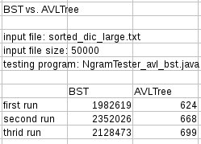
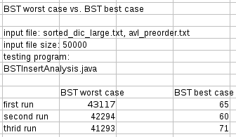
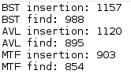
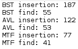
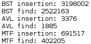
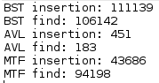

# Project 2 (uMessage) Write-Up #
--------

## Project Enjoyment ##
- How Was Your Partnership?
  <pre>It was great because we both contributed to the project a lot. Sometimes we find that by working together, we can improve our efficiency and accuracy.</pre>
  
- What was your favorite part of the project?
  <pre>Implement AVLTree because it was the hardest part of the project and requires a lot of clear thinking. Specifically, before we implement rotation, we couldn't imagine such a complex operation can be easily described in code. However, we were able to successfully break the big problem in parts and gradually finished implementation of rotation.</pre>

- What was your least favorite part of the project?
  <pre>Trying to figure out how generics work. Because it was confusing at first and even after it worked, it was still kind of unclear to me why it worked.</pre>

- How could the project be improved?
  <pre>Maybe we could do a brief intro to denerics during lecture or section because that could possibly save us a lot of time and solve some uncertainties for us.</pre>

- Did you enjoy the project?
  <pre>Overall yes, because it was cool to see uMessage working. Besides, it was amazing that we actually implemented all of the important data structures for this real application.</pre>
    
-----

## Experiments ##
Throughout p1 and p2, you have written (or used) several distinct implementations of the Dictionary interface:
 - HashTrieMap 
 - MoveToFrontList
 - BinarySearchTree
 - AVLTree
 - ChainingHashTable
 
 In this Write-Up, you will compare various aspects of these data structures.  This will take a significant amount of
 time, and you should not leave it to the last minute.  For each experiment, we expect you to:
 - Explain how you constructed the inputs to make your conclusions
 - Explain why your data supports your conclusions
 - Explain your methodology (e.g., if we wanted to re-run your experiment, we would be able to)
 - Include the inputs themselves in the experiments folder
 - Include your data either directly in the write-up or in the experiments folder
 - If you think it helps your explanation, you can include graphs of the outputs (we recommend that you do this for some of them)
 - We recommend that you keep your "N" (as in "N-gram") constant throughout these experiments. (N = 2 and N = 3 are reasonable.) 
 
### BST vs. AVLTree ###
Construct input files to NGramTester of your choosing to demonstrate that an AVL Tree is asymptotically better
than a Binary Search Tree.
<pre>
	Experiment constants:
		running machine: CSE lab linux machine
		N as in N-gram: 2
		Memory usage allowed: 6G
		Test: NGramTester\_avl\_bst.java
		Input file: sorted\_dic\_large.txt
	&nbsp;
	In this experiment, we use NGramTester\_avl\_bst.java to test runtime of find and insert for both avl tree and 
	BST. The code that executes avl find and insert in NGramTester\_avl\_bst.java is
	&nbsp;
	WordSuggestor suggestions = new WordSuggestor("sorted\_dic\_large.txt", 2, -1,
	    NGramTester\_avl\_bst.avlConstructor(),
	    NGramTester\_avl\_bst.avlConstructor());
	&nbsp;               
    	And the code that executes bst find and insert in NGramTester\_avl\_bst.java is
    &nbsp;	
    	WordSuggestor suggestions = new WordSuggestor("sorted\_dic\_large.txt", 2, -1,
            NGramTester\_avl\_bst.bstConstructor(),
            NGramTester\_avl\_bst.bstConstructor());
    &nbsp;              
    	The reason the inner map and outer map need to be both avl tree or bst tree is because the program
    	executes find and insert of both inner map and outer map, so they need to be the same.
    &nbsp;
    	The input file is a sorted dictionary, so theoretically bst tree will have worse case runtime O(n), 
    	while avl tree will have runtime O(logn).
	&nbsp; 
	Data:
		
	From the experiment data we can see that avl is significantly faster than standard bst. So AVL Tree is
	asymptotically better than a BST.
</pre>

### BST Worst Case vs. BST Best Case ###
We know that the worst case for a BST insertion is O(n) and the best case is O(lg n).  Construct input
files of your choosing that demonstrate these best and worst cases for a large n.  How big is the difference?
Is it surprising?
<pre>
	Experiment constants:
		running machine: CSE lab linux machine
		N as in N-gram: 2
		Memory usage allowed: 6G
		Test: BSTInsertAnalysis.java
		Input file: sorted\_dic\_large.txt, avl_preorder.txt
	&nbsp;
	In this experiment, we use BSTInsertAnalysis.java to test runtime of insert for bst best case and bst worst
	case. There are two input files: avl\_preorder.txt and sorted\_dic\_large.txt. avl\_preorder.txt is generated
	by a pre-order traversal of an avl tree so that when we call insert, the final bst will be balanced.
	sorted\_dic\_large.txt contains words in a sorted alphabetical order so that when we call insert, the final
	bst will be a linked list. The code for using two input files is:
	&nbsp;
	scan = new Scanner(new File("avl_preorder.txt"));    // best case
    	//scan = new Scanner(new File("sorted\_dic\_large.txt"));     // worst case
    &nbsp;
    	We switch commenting out one of the two lines to use each input file.
    &nbsp;
    	Data:
    	
    	&nbsp;
    	From the data we can see that for large n (50000) the difference of runtime is big. It is not surprising
    	because we already know the answer

</pre>
 
### ChainingHashTable ###
Your ChainingHashTable should take as an argument to its constructor the type of "chains" it uses.  Determine
which type of chain is (on average) best: an MTFList, a BST, or an AVL Tree.  Explain your intuition on why
the answer you got makes sense (or doesn't!). 
<pre>
	Experiment constants:
		running machine: CSE lab linux machine
		N as in N-gram: 2
		Test: ChainingHashTableEx.java
		Input file: random\_dic\_large.txt, spoken.corpus
	&nbsp;
	In this experiment, we use ChainingHashTableEx.java to test runtime of find and insert for a chaininghashtable
	that uses three different types of chains(MTFList, BST, AVL Tree). On average we find that a MTF list is the best.
	The input file is random\_dic\_large.txt which contains a random order of words, and spoken.corpus which contains 
	a huge amount of words.
	&nbsp;
	Data: 
	spoken.corpus:
	&nbsp;
	
	random\_dic\_large.txt
	&nbsp;
	
	&nbsp;
	For each file we can see that MTF list is the fastest on both find and insert. The reason that it is fastest on
	insert is because it just puts the element to the front which is O(1). The reason that it is fast on find is probably
	because the loading factor for a chaninghashtable is always less than 1, so there will be few elements in a 
	separate chain, in which a bst could become an overkill, and has worse performance than a MTF list.

</pre>
 
### Hash Functions ###
Write a new hash function (it doesn't have to be any good, but remember to include the code in your repository).
Compare the runtime of your ChainingHashTable when the hash function is varied.  How big of a difference can the
hash function make?  (You should keep all other inputs (e.g., the chain type) constant.)
<pre>
	Experiment constants:
		running machine: CSE lab linux machine
		N as in N-gram: 2
		Memory usage allowed: 6G
		Test: ChainingHashTableEx2.java
		Input file: random\_dic\_large.txt, spoken.corpus
	&nbsp;
	In this experiment, we change the hashcode function in CircularArrayFIFOQueue from the original to
	&nbsp;
		int index = 5;
	&nbsp;
	so that all elements will be added into one slot in a chaininghashtable.
	&nbsp;
	Data:
	&nbsp;
	spoken.corpus:
	&nbsp;
	
	&nbsp;
	random\_dic\_large.txt:
	&nbsp;
	
	&nbsp;
	From the data, we can clearly see that the runtime is much larger than using the previous hashing function. 
	The difference can be huge between a good hashing function and a super worse hashing function.
</pre>

### General Purpose Dictionary ###
Compare all of the dictionaries (on their best settings, as determined above) on several large input files.  Is
there a clear winner?  Why or why not?  Is the winner surprising to you?
<pre>
	Experiment constants:
		running machine: CSE lab windows machine
		N as in N-gram: 3
		Memory usage allowed: 6G
		Test: generalDictNGramTester.java
		Input file: random\_dic\_small.txt, archive.txt, spoken.corpus
	&nbsp;
	In this experiment. we use generalDictNGramTester.java to test all 5 dictionaries(namely, HashTrieMap, AVL Tree, 
	Standard BST, MTF list, ChaininghashTable) as outer and inner dictionaries for WordSuggestor. There are 25 
	combinations of data structures in total, so we test all of them. 
	&nbsp;
	Before each test, we find that a preload function is needed so that the first test will have relatively equal
	performance compared to other tests. Here is our preload function.
	&nbsp;
	
	The reason this preload is needed is probably because the file needs to be first loaded into cache.
	&nbsp;
	We have three input files: random\_dic\_small.txt, archive.txt and spoken.corpus, ranked by
	the file size. We first test these 25 data structure combinations on random\_dic\_small.txt which has 5000
	lies. The result is as follow:
	&nbsp;
	
	&nbsp;
	After the first experiment, we find that using ChainingHashTable and MTF list as outer map is a bad choice.
	So we removed those combinations when using input files archive.txt. The second result is as follow:
	&nbsp;
	
	&nbsp; 
	From the second round, we find that using trie_avl, trie_bst, trie_mtf has the best performance overall. So
	we keep comparing them using spoken.corpus to see which one is the best for uMessage:
	&nbsp;
	
	&nbsp;
	We finally find that using trie as the outer map, and MTF list as the inner map is the best choice. 
	Trie\_avl and Trie\_bst has a slightly worse performance than trie_mtf. The winner surprises us since we
	did not expect MTF list has such a good performance.
	
	

</pre>

### General Sorts ###
You have several general purpose sorts (InsertionSort, HeapSort, TopKSort).  We would like you to compare these
sorts using *step counting*. That is, for all other experiments, you likely compared the time it took for the various
things to run, but for this one, we want you to (1) choose a definition of step, (2) modify the sorting algorithms to
calculate the number of steps, and (3) compare the results.  In this case, there is a "good" definition of step, and
there are many bad ones.  We expect you to justify your choice.
<pre>
	Experiment constants:
		running machine: CSE lab linux machine
		SIZE: 50000, 100000, 200000.
		Test: sortExperiment.java
	&nbsp;
	In this experiment we use sortExperiment.java to test several general purpose sorts, for each sort, we 
	fix the SIZE(the amount of integers to sort) to compare these sorts under the same condition.
	&nbsp;
	Definition of steps:
	&nbsp;
	we define steps to be the number of comparisons.
	&nbsp;
	For heapsort, we have the following code to calculate steps:
	&nbsp;
	
	&nbsp;
	in the first for each loop, after adding an element into a heap, the average number of steps should add log4(n) 
	because it is a minfourheap and has a height of log4(n), for each height we need one comparison to percolate up.
	&nbsp;
	In the second for each loop, after removing min from the heap, the average number of steps should also add
	log4(n) after approximate careful calculation(namely, the ratio of the amount of non leaves and the amount of 
	leaves is 3:1, and non leaves take four comparison each time, leaves take no comparison each time, so
	(3 * 0 + 1 * 4) / 4 = 1, so average number of 1 comparison for each level.)
	&nbsp;
	For Quicksort, we have the following code:
	&nbsp;
	
	&nbsp;
	within each while loop, there is one comparison, so step should increment one. We did not increment step for finding
	the pivot and swap it to the front since that takes constant time.
	&nbsp;
	For Insertionsort, we have the following code to calculate steps:
	&nbsp;
	
	&nbsp;
	within each for loop, there is one comparison, so step should increment one.
	&nbsp;
	Data:
	&nbsp;
	
	&nbsp;
	from the data, we reach the several conclusions:
	1)heapsort is the fastest according our definition of steps.
	2)steps of heapsort and quicksort increase within the bound nlogn, which satisfies the theoretical bound O(nlogn),
	and stesp of insertion sort increase within the bound n^2, which satisfies the theoretical bound O(n^2).
	3)topKsort is faster than heapsort when k < n ,and equivilant to heapsort when k = n.
	

</pre>

### Top K Sort ###
TopKSort should theoretically be better for small values of k.  Determine (using timing or step-counting--your choice)
which n (input size) and k (number of elements sorted) makes TopKSort worthwhile over your best sort from the previous
experiment. 
<pre>
	

</pre>

### uMessage ###
Use uMessage to test out your implementations.  Using N=3, uMessage should take less than a minute to load using
your best algorithms and data structures on a reasonable machine.

 -  How are the suggestions uMessage gives with the default corpus?
    <pre>
		The suggestions the default corpus gives do not make any sence they are crap

	</pre>

 - Now, switch uMessage to use a corpus of YOUR OWN text. To do this, you will need a corpus. 
   You can use anything you like (Facebook, google talk, e-mails, etc.)  We provide
   instructions and a script to format Facebook data correctly as we expect it will be the most common
   choice.  If you are having problems getting data, please come to office hours and ask for help.
   Alternatively, you can concatenate a bunch of English papers you've written together to get a corpus
   of your writing.  PLEASE DO NOT INCLUDE "me.txt" IN YOUR REPOSITORY.  WE DO NOT WANT YOUR PRIVATE CONVERSATIONS.
     * Follow these instructions to get your Facebook data: https://www.facebook.com/help/212802592074644
     * Run the ParseFBMessages program in the main package.
     * Use the output file "me.txt" as the corpus for uMessage.
 
 - How are the suggestions uMessage gives wth the new corpus?
   <pre>TODO</pre>

-----

## Above and Beyond ##
-   Did you do any Above and Beyond?  Describe exactly what you implemented.
 <pre>Wat</pre>